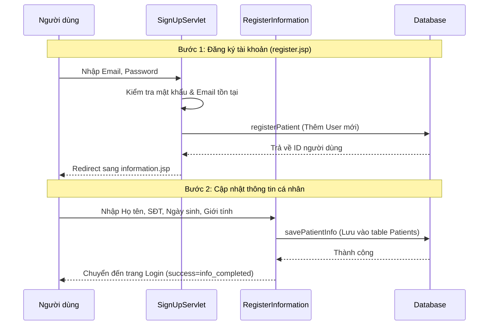
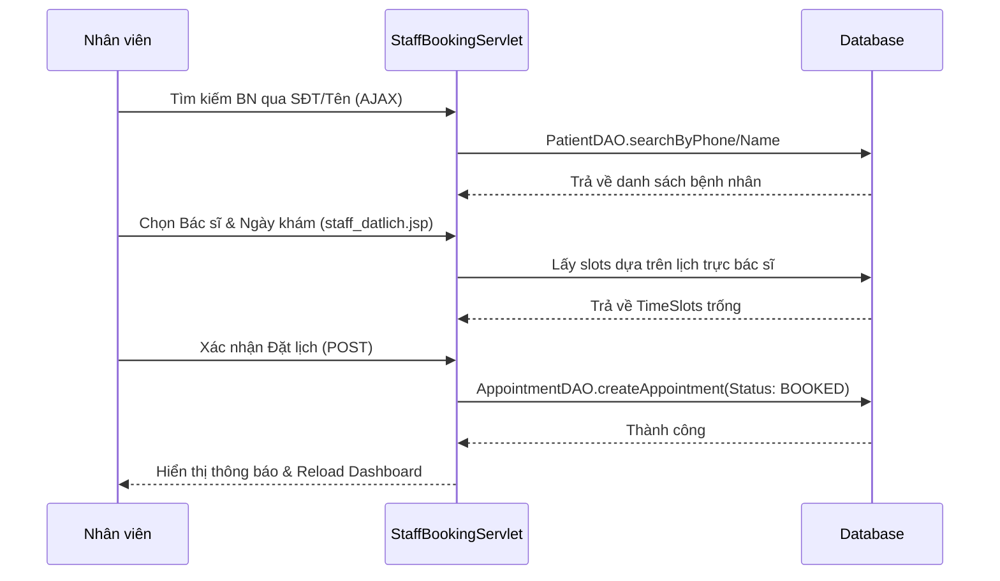
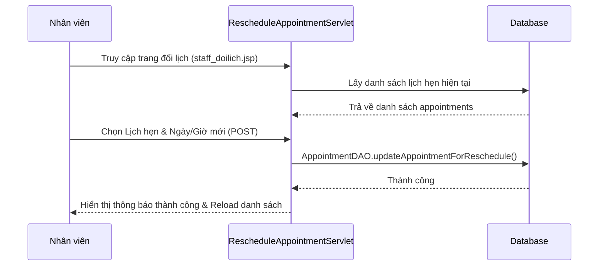
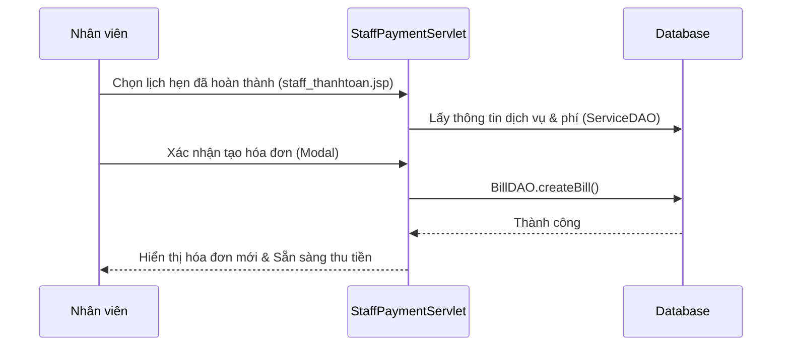
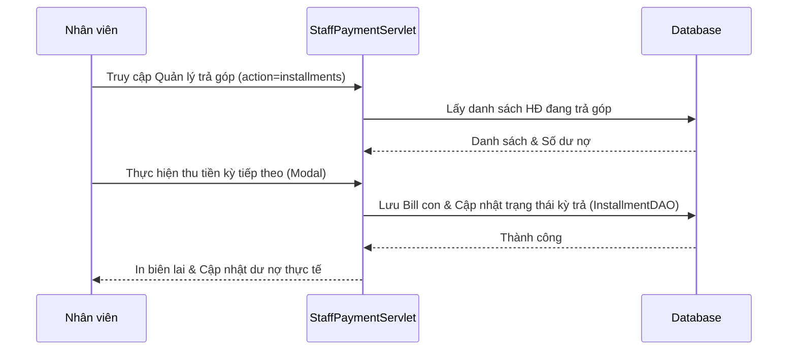
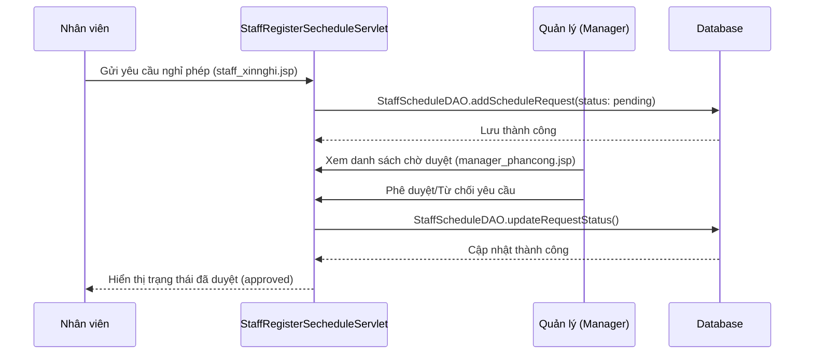

# Dental Clinic Management System - PRJ301 (Full Technical Documentation)

Hệ thống quản lý phòng khám nha khoa toàn diện, tích hợp các công nghệ hiện đại phục vụ quản trị và trải nghiệm khách hàng.

---

## 🛠 Công nghệ & Kiến trúc (Tech Stack)
- **Kiến trúc:** Model-View-Controller (MVC).
- **Backend:** Java Servlet, Jakarta EE, JDBC.
- **Frontend:** JSP, Bootstrap 5, Vanilla JS, AJAX (Gson).
- **Database:** SQL Server (Normalized DB).
- **Tích hợp:** PayOS (Thanh toán QR), Google OAuth 2.0 (Đăng nhập), n8n Automation (Email & Google Calendar).

---

## 🔄 Chi tiết Luồng Nghiệp vụ (Sequence Diagrams)

### 1. Luồng BỆNH NHÂN (PATIENT)

#### A. Đăng nhập bằng Google
```mermaid
sequenceDiagram
    U as Người dùng
    GG as Google Auth Server
    C as GoogleCallbackServlet
    L as LoginServlet
    DB as Database

    U->>GG: Nhấn "Login with Google" (login.jsp)
    GG-->>C: Trả về Authorization Code
    C->>GG: Exchange Code lấy Access Token
    C->>GG: Lấy thông tin User (Email/Name)
    C->>L: Chuyển tiếp thông tin User
    L->>DB: Kiểm tra Email (UserDAO)
    alt Chưa có tài khoản
        L->>DB: Tạo mới User & Patient
    end
    DB-->>L: Thành công
    L->>L: Lưu User vào Session
    L-->>U: Chuyển đến Dashboard theo Role
```

#### B. Đăng ký tài khoản & Hoàn tất thông tin



#### C. Đặt lịch & Thanh toán PayOS
```mermaid
sequenceDiagram
    U as Bệnh nhân
    B as BookingServlet
    P as PayOSServlet
    PY as Cổng PayOS
    N8N as n8n Webhook
    DB as Database

    U->>B: Chọn Bác sĩ/Ngày (booking.jsp)
    B->>DB: Lấy slots trống (check-slots)
    U->>B: Chọn Slot & Nhấn Đặt lịch
    B->>DB: createReservation (Giữ chỗ 5p)
    B-->>P: Chuyển sang PayOSServlet
    P->>PY: Tạo Payment Link & QR Code
    P-->>U: Redirect sang trang Thanh toán PayOS
    U->>PY: Quét mã QR & Trả tiền
    PY-->>P: Callback thành công (?action=success)
    P->>DB: Update Bill (PAID) & Appointment (BOOKED)
    P->>N8N: Đẩy dữ liệu sang n8n
    N8N->>N8N: Gửi Email & Add Google Calendar
    P-->>U: Hiển thị payment-success.jsp
```

#### D. Quên mật khẩu (Reset Password)
```mermaid
sequenceDiagram
    U as Người dùng
    S as ResetPasswordServlet
    E as Email Service
    DB as Database
    
    U->>S: Nhập Email (forgot-password.jsp)
    S->>DB: Kiểm tra Email tồn tại?
    DB-->>S: Có tồn tại
    S->>E: Gửi email mã OTP
    S->>S: Lưu OTP vào Session
    S-->>U: Chuyển đến trang verify-otp.jsp
    U->>S: Nhập mã OTP
    S->>S: So sánh OTP trong Session
    S-->>U: Chuyển đến trang reset-password.jsp
    U->>S: Nhập mật khẩu mới
    S->>DB: Cập nhật mật khẩu mới (updatePasswordByEmail)
    S-->>U: Thông báo thành công, quay về Login
```

#### E. Chỉnh sửa thông tin cá nhân (Profile Settings)
```mermaid
sequenceDiagram
    U as Bệnh nhân
    S as UpdateUserServlet
    DB as Database

    U->>S: Truy cập trang cá nhân (user_taikhoan.jsp)
    S->>S: Load thông tin từ Session (user/patient)
    U->>S: Gửi yêu cầu cập nhật (Họ tên, SĐT, Giới tính, Ảnh đại diện)
    S->>DB: PatientDAO.updatePatientInfo()
    alt Cập nhật Email/Mật khẩu
        S->>DB: UserDAO.updateEmail() / UserDAO.updatePasswordHash()
    end
    DB-->>S: Thành công
    S-->>U: Cập nhật lại Session & Hiển thị thông báo (user_taikhoan.jsp)
```

#### F. Tư vấn & Chat với Bác sĩ (Real-time Chat)
```mermaid
sequenceDiagram
    U as Bệnh nhân
    P as ChatPageServlet
    WS as ChatEndPoint (WebSocket)
    DB as Database

    U->>P: Truy cập trang tư vấn (ChatPageServlet)
    P-->>U: Hiển thị patient_chat.jsp
    U->>WS: Kết nối WebSocket endpoint (/chat)
    WS->>DB: Kiểm tra Role & Session
    WS-->>U: Gửi danh sách bác sĩ đang online (doctorlist)
    U->>WS: Gửi tin nhắn [DoctorID]|[Nội dung]
    WS->>DB: Lưu tin nhắn vào bảng ChatMessages
    WS-->>U: Relay tin nhắn (Xác nhận gửi)
    WS->>U: Nhận phản hồi từ Bác sĩ (Real-time)
```

#### G. Tư vấn với Trợ lý AI (Gemini)
```mermaid
sequenceDiagram
    U as Bệnh nhân
    S as ChatAiServlet
    AI as Gemini AI Service
    
    U->>S: Gửi câu hỏi (AJAX POST)
    S->>AI: GeminiAiService.getAIResponse()
    AI-->>S: Trả về nội dung phản hồi (Text)
    S->>S: Định dạng lại văn bản (Markdown/HTML)
    S-->>U: Hiển thị phản hồi lên khung chat
```


---

### 2. Luồng BÁC SĨ (DOCTOR)

#### A. Quy trình Khám bệnh (Medical Report)
```mermaid
sequenceDiagram
    D as Bác sĩ
    C as CreateMedicalReportServlet
    S as SubmitMedicalReportServlet
    DB as Database

    D->>C: Chọn bệnh nhân khám (doctor_homepage.jsp)
    C->>DB: Lấy thông tin Bệnh nhân/Lịch hẹn
    C-->>D: Hiển thị form khám (doctor_phieukham.jsp)
    D->>S: Nhập chẩn đoán, kê đơn, chọn dịch vụ
    S->>DB: Lưu MedicalReports
    S->>DB: Lưu TreatmentDetails (Dịch vụ/Thuốc)
    S->>DB: Update Appointment (COMPLETED)
    S-->>D: Quay về Dashboard, báo thành công
```

#### B. Đăng ký & Quản lý lịch nghỉ
```mermaid
sequenceDiagram
    D as Bác sĩ
    S as DoctorRegisterScheduleServlet
    M as Quản lý
    DB as Database

    D->>S: Đăng ký ngày nghỉ (doctor_dangkilich.jsp)
    S->>S: Xác định loại request là 'leave'
    S->>DB: Lưu yêu cầu nghỉ với trạng thái 'pending'
    S-->>D: Hiển thị tại mục "Chờ duyệt"

    Note over M, DB: Manager phê duyệt tại manager_phancong.jsp
    M->>DB: Cập nhật trạng thái 'Đã duyệt' hoặc 'Từ chối'
    DB-->>M: Thành công
    
    Note over D, DB: Bác sĩ xem kết quả tại mục "Đã duyệt/Từ chối"
```

#### C. Đổi mật khẩu (Security)
```mermaid
sequenceDiagram
    D as Bác sĩ
    S as DoctorChangePasswordServlet
    DB as Database

    D->>S: Nhập MK cũ, MK mới (doctor_changepassword.jsp)
    S->>S: Validate mật khẩu mới (khớp, độ dài >=6)
    S->>DB: UserDAO.loginUserInstance (Kiểm tra MK cũ)
    alt Mật khẩu cũ đúng
        S->>DB: UserDAO.updatePasswordInstance (Update MK mới)
        DB-->>S: Thành công
        S-->>D: Thông báo thành công (Success alert)
    else Mật khẩu cũ sai
        S-->>D: Báo lỗi: Mật khẩu hiện tại không đúng
    end
```

#### D. Tư vấn & Chat trực tuyến (Real-time Chat)
```mermaid
sequenceDiagram
    D as Bác sĩ
    P as ChatPageServlet
    WS as ChatEndPoint (WebSocket)
    DB as Database

    D->>P: Truy cập trang tư vấn (ChatPageServlet)
    P-->>D: Hiển thị doctor_chat.jsp
    D->>WS: Kết nối WebSocket endpoint (/chat)
    WS->>DB: Kiểm tra Role & Session
    WS-->>D: Gửi danh sách bệnh nhân đang online (patientlist)
    D->>WS: Gửi tin nhắn [PatientID]|[Nội dung]
    WS->>DB: Lưu tin nhắn vào bảng ChatMessages
    WS-->>D: Relay tin nhắn (Xác nhận gửi)
    WS->>D: Nhận tin từ Bệnh nhân (Real-time)
```

#### E. Chỉnh sửa thông tin cá nhân (Profile Settings)
```mermaid
sequenceDiagram
    D as Bác sĩ
    S as EditDoctorServlet
    DB as Database

    D->>S: Truy cập trang cài đặt (doctor_caidat.jsp)
    S->>DB: DoctorDAO.getDoctorByUserId()
    DB-->>S: Trả về thông tin hiện tại
    S-->>D: Hiển thị form chỉnh sửa
    D->>S: Gửi thông tin mới (Họ tên, SĐT, Chuyên khoa,...)
    S->>DB: DoctorDAO.updateDoctor()
    DB-->>S: Thành công
    S-->>D: Chuyển hướng về trang cài đặt & Báo thành công
```


---

### 3. Luồng NHÂN VIÊN (STAFF)

#### A. Đặt lịch hẹn hộ Bệnh nhân (Staff Booking)


#### B. Đổi lịch hẹn cho bệnh nhân (Reschedule Appointment)


#### C. Tạo hóa đơn cho Bệnh nhân (Create Invoice)


#### D. Thanh toán Trả góp (Installment)
```mermaid
sequenceDiagram
    ST as Nhân viên
    SV as StaffPaymentServlet
    DB as Database

    ST->>SV: Chọn HĐ & Chọn Trả góp (staff_thanhtoan.jsp)
    SV->>DB: createInstallmentPlan (PaymentInstallmentDAO)
    DB-->>SV: Tạo các kỳ hạn thanh toán
    SV->>DB: Lưu bill con đầu tiên (Down Payment)
    SV-->>ST: Hiển thị kế hoạch trả góp & QR thu tiền
```

#### E. Quản lý & Thu tiền trả góp (Installment Management)


#### F. Đăng ký Nghỉ phép (Leave Request)



---

### 4. Luồng QUẢN LÝ (MANAGER)

#### A. Phê duyệt Lịch trực
```mermaid
sequenceDiagram
    M as Quản lý
    A as ManagerApprovalDoctorServlet
    DB as Database

    M->>A: Xem danh sách đăng ký lịch (manager_phancong.jsp)
    M->>A: Nhấn Duyệt/Từ chối
    A->>DB: Update Schedule Status (Approved/Rejected)
    DB-->>A: Thành công
    A-->>M: Cập nhật danh sách trang phân công
```

#### B. Quản lý Nhân sự (Thêm Bác sĩ/Nhân viên)
```mermaid
sequenceDiagram
    M as Quản lý
    S as AddStaffServlet
    DB as Database

    M->>S: Nhập thông tin nhân viên (manager_danhsach.jsp)
    S->>S: Kiểm tra quyền MANAGER
    S->>S: Validate Email/SĐT
    S->>DB: Insert vào bảng Users (Mật khẩu mặc định 12345)
    alt Role là DOCTOR
        S->>DB: Insert vào bảng Doctors
    else Role là STAFF
        S->>DB: Insert vào bảng Staffs
    end
    DB-->>S: Thành công
    S-->>M: Thông báo thành công & Reload danh sách
```

#### C. Quản lý Kho thuốc (Add Medicine)
```mermaid
sequenceDiagram
    M as Quản lý
    S as AddMedicineServlet
    DB as Database

    M->>S: Nhập tên thuốc, số lượng, đơn vị (manager_khothuoc.jsp)
    S->>DB: MedicineDAO.addMedicine()
    DB-->>S: Thành công
    S-->>M: Cập nhật kho thuốc & Thông báo thành công
```

#### D. Quản lý Khách hàng (View Customer List)
```mermaid
sequenceDiagram
    M as Quản lý
    S as ManagerCustomerListServlet
    DB as Database
    
    M->>S: Truy cập trang Khách hàng (manager_customers.jsp)
    S->>DB: Lấy danh sách bệnh nhân (Pagination)
    S->>DB: Thống kê khách hàng mới trong tháng
    DB-->>S: Trả về dữ liệu
    S-->>M: Hiển thị danh sách & Thống kê Dashboard
```


---

## 📂 Mapping Kỹ thuật (Servlet/JSP/DAO)

| Vai trò | Chức năng | JSP (Front-end) | Servlet (Back-end) | DAO |
| :--- | :--- | :--- | :--- | :--- |
| **Patient** | Google Login | `login.jsp` | `GoogleCallbackServlet` | `UserDAO` |
| **Patient** | Đăng ký | `register.jsp` | `SignUpServlet` | `UserDAO` |
| **Patient** | Hoàn tất thông tin | `information.jsp` | `RegisterInformation` | `UserDAO` |
| **Patient** | Book Appointment | `booking.jsp` | `BookingServlet` | `AppointmentDAO` |
| **Patient** | Online Payment | `payos.com` | `PayOSServlet` | `BillDAO` |
| **Patient** | Reset Password | `forgot-password.jsp` | `ResetPasswordServlet` | `UserDAO` |
| **Patient** | Chỉnh sửa profile | `user_taikhoan.jsp` | `UpdateUserServlet` | `PatientDAO/UserDAO` |
| **Patient** | Tư vấn/Chat | `patient_chat.jsp` | `ChatPageServlet` | `ChatMessages` (Table) |
| **Patient** | Chat với AI | `Sidebar/AI` | `ChatAiServlet` | `Gemini API` |
| **Doctor** | Thăm khám | `doctor_phieukham.jsp` | `SubmitMedicalReportServlet` | `MedicalReportDAO` |
| **Doctor** | Đăng ký lịch | `doctor_dangkilich.jsp`| `DoctorRegisterScheduleServlet`| `DoctorScheduleDAO` |
| **Doctor** | Đổi mật khẩu | `doctor_changepassword.jsp`| `DoctorChangePasswordServlet` | `UserDAO` |
| **Doctor** | Chỉnh sửa profile | `doctor_caidat.jsp` | `EditDoctorServlet` | `DoctorDAO` |
| **Doctor** | Tư vấn/Chat | `doctor_chat.jsp` | `ChatPageServlet` | `ChatMessages` (Table) |
| **Staff** | Đặt lịch hộ | `staff_datlich.jsp` | `StaffBookingServlet` | `AppointmentDAO` |
| **Staff** | Đổi lịch hẹn | `staff_doilich.jsp` | `RescheduleAppointmentServlet` | `AppointmentDAO` |
| **Staff** | Tạo hóa đơn | `staff_thanhtoan.jsp` | `StaffPaymentServlet` | `BillDAO` |
| **Staff** | Quản lý trả góp| `staff_thanhtoan.jsp` | `StaffPaymentServlet` | `PaymentInstallmentDAO` |
| **Staff** | Đăng ký nghỉ | `staff_xinnghi.jsp` | `StaffRegisterSecheduleServlet` | `StaffScheduleDAO` |
| **Staff** | Thanh toán | `staff_thanhtoan.jsp` | `StaffPaymentServlet` | `BillDAO` |
| **Staff** | Check-in | `staff_dashboard.jsp` | `StaffHandleQueueServlet` | `AppointmentDAO` |
| **Manager** | Duyệt lịch | `manager_phancong.jsp` | `ManagerApprovalDoctorServlet` | `ScheduleDAO` |
| **Manager** | Thêm nhân sự | `manager_danhsach.jsp` | `AddStaffServlet` | `StaffDAO/DoctorDAO` |
| **Manager** | Quản lý kho thuốc| `manager_khothuoc.jsp`| `AddMedicineServlet` | `MedicineDAO` |
| **Manager** | Xem khách hàng | `manager_customers.jsp`| `ManagerCustomerListServlet` | `PatientDAO` |

---
*Tài liệu hướng dẫn hệ thống được cập nhật trực tiếp bởi Antigravity.*
