# Dental Clinic Management System - PRJ301 (Full Technical Documentation)

Hệ thống quản lý phòng khám nha khoa toàn diện, tích hợp các công nghệ hiện đại phục vụ quản trị và trải nghiệm khách hàng.

---

## 🛠 Công nghệ & Kiến trúc (Tech Stack)
- **Kiến trúc:** Model-View-Controller (MVC).
- **Backend:** Java Servlet, Jakarta EE, JDBC.
- **Frontend:** JSP, Bootstrap 5, Vanilla JS, AJAX (Gson).
- **Database:** SQL Server (Normalized DB).
- **Tích hợp:** PayOS (Thanh toán QR), Google OAuth 2.0 (Đăng nhập), n8n Automation (Email & Google Calendar).

---

## 🔄 Chi tiết Luồng Nghiệp vụ (Sequence Diagrams)

### 1. Luồng CHUNG (GENERAL)

#### A. Đăng nhập hệ thống (System Login)
Mô tả chi tiết kỹ thuật:
- **Giao diện (Front-end):** Người dùng nhập Email/Password tại `login.jsp`.
- **Điều hướng (Servlet):** Form gửi dữ liệu (POST) đến `LoginServlet.java`.
- **Xử lý dữ liệu (DAO):** `LoginServlet` gọi hàm `UserDAO.loginUser(email, password)`.
- **Xác thực:** 
    - `UserDAO` tìm User theo email trong database.
    - Gọi hàm `checkPassword()` để kiểm tra mã băm (hỗ trợ cả **BCrypt**, **MD5** legacy và **Plain text**).
- **Kết quả:** Nếu thành công, hệ thống khởi tạo `HttpSession` chứa `user`, `role`, `userId` và chuyển hướng đến Dashboard tương ứng của từng vai trò (Patient, Doctor, Staff, Manager).

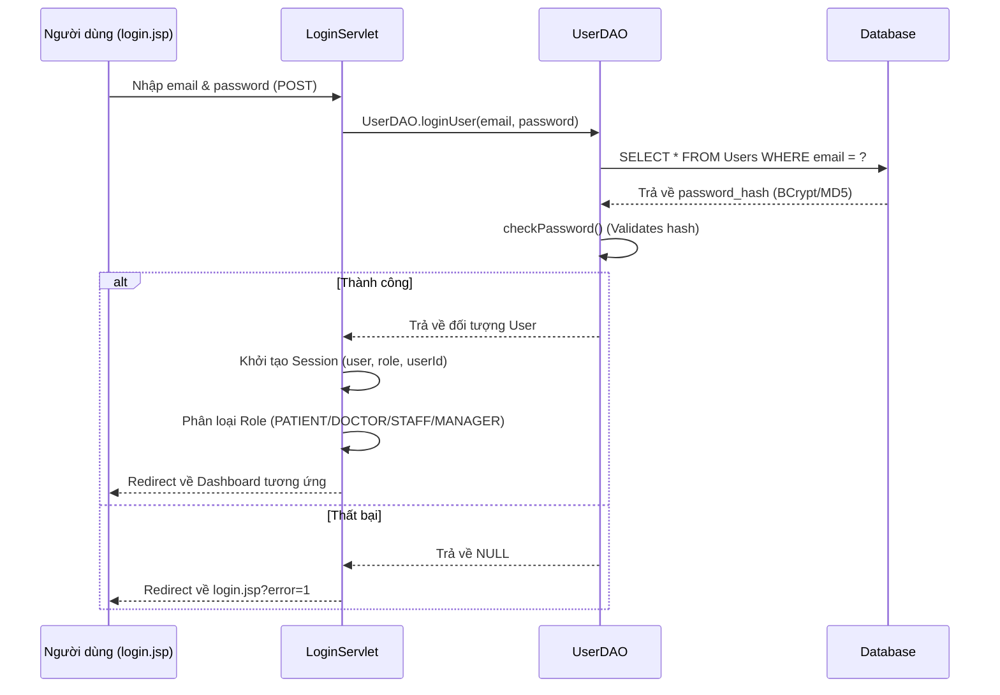

### 2. Luồng BỆNH NHÂN (PATIENT)

#### A. Đăng nhập bằng Google (Google OAuth 2.0)
Mô tả chi tiết kỹ thuật:
- **Nút bấm (Front-end):** Người dùng nhấn nút "Login with Google" tại `login.jsp`. Nút này điều hướng đến URL ủy quyền của Google.
- **Xử lý Callback (Servlet):** Google chuyển hướng kèm theo `Authorization Code` về `GoogleCallbackServlet` (URL: `/LoginGG/LoginGoogleHandler`).
- **Trao đổi Token:** 
    - `GoogleCallbackServlet` dùng Code để đổi lấy `Access Token`.
    - Gọi Google API (`userinfo`) để lấy `Email` và `Name` của người dùng.
    - Lưu `userEmail` và `userName` vào Session rồi redirect sang `LoginServlet`.
- **Đăng ký & Đăng nhập (Back-end):**
    - `LoginServlet` kiểm tra email trong Database bằng `UserDAO.getUserByEmail()`.
    - **Trường hợp 1 (Tài khoản đã tồn tại):** Lấy thông tin User và chuyển hướng về Dashboard tương ứng.
    - **Trường hợp 2 (Tài khoản mới):** 
        - Gọi `UserDAO.addUserGoogle(email, name)` để tạo bản ghi mới trong bảng `Users`.
        - Gọi `PatientDAO.addPatientFromGoogle(userId, name)` để tạo hồ sơ bệnh nhân mặc định.
- **Kết quả:** Thiết lập Session và đưa bệnh nhân vào trang chủ của khách hàng.

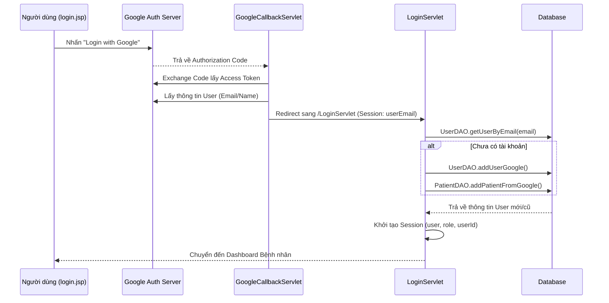

#### B. Đăng ký tài khoản & Hoàn tất thông tin
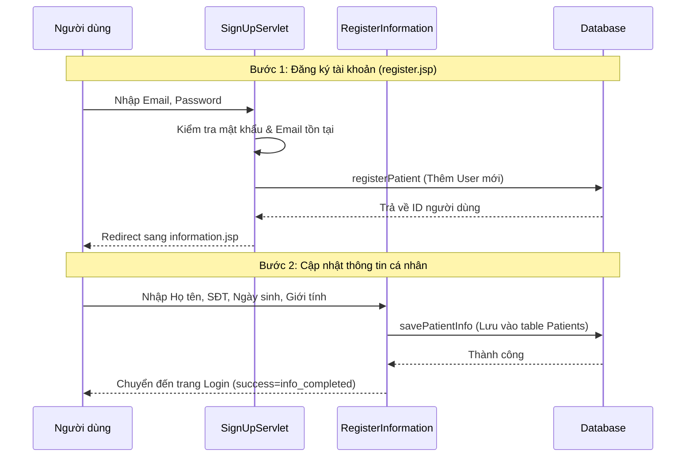


#### C. Đặt lịch & Thanh toán Online (PayOS)
Mô tả chi tiết kỹ thuật:
- **Chọn lịch (Front-end):** Bệnh nhân chọn dịch vụ, bác sĩ, ngày và giờ tại `booking.jsp`.
- **Tạm giữ chỗ (AJAX):** Khi chọn slot, JS từ Front-end gọi `BookingServlet?action=reserve-slot`.
    - `AppointmentDAO.createReservation()` được gọi để khóa slot trong **5 phút** bằng bảng `SlotReservations`.
- **Tạo yêu cầu thanh toán (Servlet):** Khi nhấn "Thanh toán", form gửi yêu cầu `POST` đến `BookingServlet?action=book`.
    - `BookingServlet` kiểm tra thông tin và chuyển hướng (Redirect) sang `PayOSServlet`.
- **Xử lý PayOS (Servlet - Back-end):**
    - `PayOSServlet` gọi `BillDAO.createBill()` để tạo bản ghi hóa đơn với trạng thái `pending`.
    - Sử dụng `PayOSDirectHelper` kết nối API PayOS để tạo Link thanh toán QR Code.
    - Hệ thống chuyển hướng người dùng sang trang thanh toán chính thức của PayOS.
- **Xác nhận thành công (Callback):** Sau khi bệnh nhân quét mã và trả tiền thành công, PayOS gọi về URL callback: `PayOSServlet?action=success`.
    - `BillDAO.updatePaymentStatus()` cập nhật hóa đơn thành `success`.
    - `AppointmentDAO.insertAppointmentFromReservation()` chuyển đổi thông tin từ lệnh giữ chỗ sang lịch hẹn chính thức (`Appointments` table) với trạng thái `BOOKED`.
    - `N8nWebhookService` thực hiện gửi Email xác nhận tự động và tạo sự kiện trên Google Calendar của bệnh nhân.
- **Kết quả:** Người dùng được đưa về trang `payment-success.jsp` để xem biên lai.

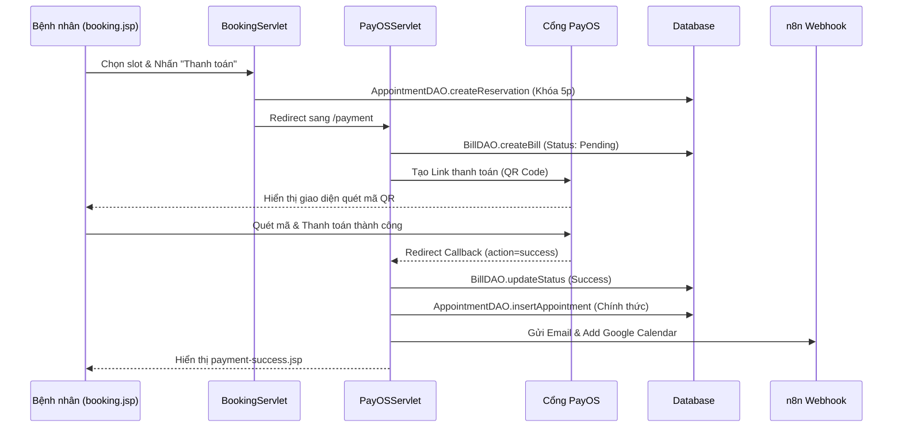


#### D. Quên mật khẩu & Đặt lại Password (OTP Flow)
Mô tả chi tiết kỹ thuật:
- **Yêu cầu (Front-end):** Người dùng nhấn "Forgot Password?" tại `login.jsp`, nhập Email tại `forgot-password.jsp`.
- **Gửi OTP (Servlet):** `ResetPasswordServlet` tiếp nhận action `send-otp`.
    - Gọi `UserDAO.getUserByEmail()` để đảm bảo email có thật.
    - Gọi `OTPService` tạo mã 6 chữ số và lưu vào Session.
    - `EmailService` thực hiện gửi mã OTP đến email người dùng.
- **Xác thực (Servlet):** Người dùng nhập mã tại `verify-otp.jsp`.
    - `ResetPasswordServlet` kiểm tra mã khớp và chưa hết hạn (thông qua `OTPService`).
    - Nếu đúng, đánh dấu `otpVerified = true` trong Session.
- **Cập nhật (Back-end):** Người dùng nhập mật khẩu mới tại `reset-password.jsp`.
    - `ResetPasswordServlet` validate độ mạnh mật khẩu.
    - Gọi `UserDAO.updatePasswordByEmail(email, newPassword)`.
    - Hệ thống tự động mã hóa mật khẩu mới sang **BCrypt** trước khi lưu vào DB.
- **Kết quả:** Redirect về `login.jsp` với thông báo thành công.

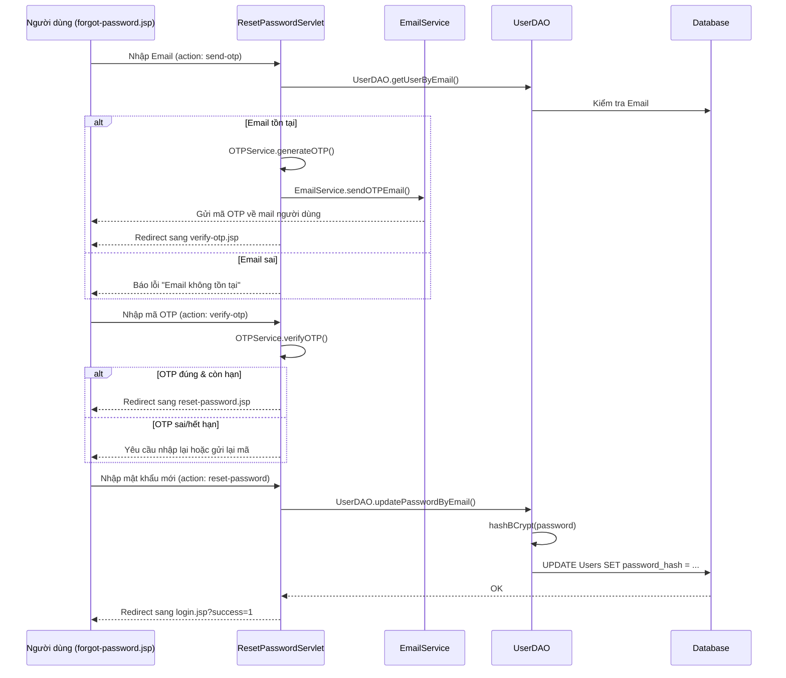


#### E. Chỉnh sửa thông tin cá nhân (Profile Settings)
```mermaid
sequenceDiagram
    U as Bệnh nhân
    S as UpdateUserServlet
    DB as Database

    U->>S: Truy cập trang cá nhân (user_taikhoan.jsp)
    S->>S: Load thông tin từ Session (user/patient)
    U->>S: Gửi yêu cầu cập nhật (Họ tên, SĐT, Giới tính, Ảnh đại diện)
    S->>DB: PatientDAO.updatePatientInfo()
    alt Cập nhật Email/Mật khẩu
        S->>DB: UserDAO.updateEmail() / UserDAO.updatePasswordHash()
    end
    DB-->>S: Thành công
    S-->>U: Cập nhật lại Session & Hiển thị thông báo (user_taikhoan.jsp)
```

#### F. Tư vấn & Chat với Bác sĩ (Real-time Chat)
Mô tả chi tiết kỹ thuật:
- **Khởi tạo (Front-end):** Bệnh nhân/Bác sĩ nhấn nút "Chat" hoặc "Tư vấn" trên giao diện.
- **Điều hướng (Servlet):** `ChatPageServlet` kiểm tra `User Role` trong Session và chuyển hướng đến trang tương ứng (`patient_chat.jsp` hoặc `doctor_chat.jsp`).
- **Kết nối (WebSocket):** Sau khi trang JSP load, JavaScript(`socket.js`) khởi tạo kết nối đến WebSocket Endpoint `/chat`.
    - `ChatEndPoint.java` tiếp nhận kết nối (`OnOpen`), xác thực người dùng qua `HttpSession`.
    - Hệ thống gửi danh sách bác sĩ/bệnh nhân đang online (`doctorlist` / `patientlist`) về phía người dùng.
- **Gửi tin nhắn (Back-end Logic):** Tin nhắn được gửi dưới dạng chuỗi `[ID_NGƯỜI_NHẬN]|[NỘI_DUNG]`.
    - `ChatEndPoint.onMessage()` tiếp nhận tin nhắn.
    - **Lưu trữ:** Lưu trực tiếp vào bảng `ChatMessages` trong Database (sử dụng `DBContext`).
    - **Chuyển tiếp (Real-time):** Tìm kiếm Session của người nhận dựa trên ID và gửi ngay lập tức.
- **Lịch sử Chat:** Khi mở khung chat với một người cụ thể, client gửi yêu cầu `HISTORY_REQUEST|[PARTNER_ID]`. `ChatEndPoint` truy vấn Database và gửi lại 50 tin nhắn gần nhất.

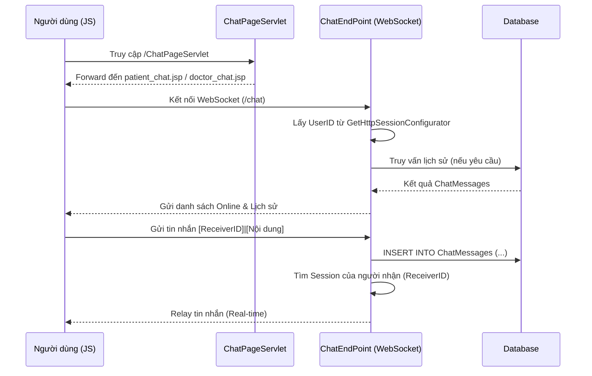


#### G. Tư vấn với Trợ lý AI (Gemini)
Mô tả chi tiết kỹ thuật:
- **Gửi câu hỏi (Front-end):** Người dùng nhập câu hỏi vào khung chat AI (thường nằm ở góc màn hình) và nhấn gửi. JavaScript gửi một yêu cầu `AJAX POST` chứa nội dung tin nhắn đến `ChatAiServlet`.
- **Tiếp nhận (Servlet):** `ChatAiServlet.java` nhận tham số `message`.
- **Xử lý AI (Service Layer):**
    - `ChatAiServlet` gọi hàm `GeminiAiService.getAIResponse(userMessage)`.
    - `GeminiAiService` lấy API Key từ file cấu hình `.env` thông qua lớp `util.Env`.
    - **System Instruction:** Hệ thống gửi kèm một chỉ thị ẩn ("Bạn là trợ lý ảo chuyên nghiệp của nha khoa Happy Smile...") để ép AI chỉ trả lời các vấn đề về nha khoa và luôn gợi ý đặt lịch tại phòng khám.
    - Gửi yêu cầu `HTTP POST` đến Google Generative Language API (mô hình `gemini-flash-latest`).
- **Hậu xử lý (Formatting):**
    - Sau khi nhận phản hồi text từ Google, hệ thống gọi `GeminiAiService.formatAIResponse()`.
    - Hàm này thực hiện: Chuyển đổi Markdown sang HTML (`<br>`, `<b>`), bôi đậm các từ khóa y tế (`đau răng`, `viêm`, `nhổ răng`) bằng CSS để người dùng dễ chú ý.
- **Kết quả:** Trả về đoạn mã HTML hoàn chỉnh để hiển thị trực tiếp lên bong bóng chat của người dùng.

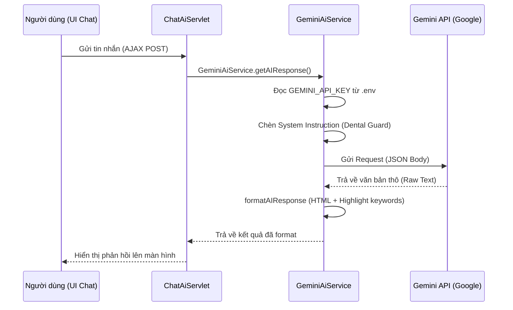


---

### 3. Luồng BÁC SĨ (DOCTOR)
#### A. Quy trình Khám bệnh (Medical Report)
```mermaid
sequenceDiagram
    D as Bác sĩ
    C as CreateMedicalReportServlet
    S as SubmitMedicalReportServlet
    DB as Database

    D->>C: Chọn bệnh nhân khám (doctor_homepage.jsp)
    C->>DB: Lấy thông tin Bệnh nhân/Lịch hẹn
    C-->>D: Hiển thị form khám (doctor_phieukham.jsp)
    D->>S: Nhập chẩn đoán, kê đơn, chọn dịch vụ
    S->>DB: Lưu MedicalReports
    S->>DB: Lưu TreatmentDetails (Dịch vụ/Thuốc)
    S->>DB: Update Appointment (COMPLETED)
    S-->>D: Quay về Dashboard, báo thành công
```

#### B. Đăng ký & Quản lý lịch nghỉ
```mermaid
sequenceDiagram
    D as Bác sĩ
    S as DoctorRegisterScheduleServlet
    M as Quản lý
    DB as Database

    D->>S: Đăng ký ngày nghỉ (doctor_dangkilich.jsp)
    S->>S: Xác định loại request là 'leave'
    S->>DB: Lưu yêu cầu nghỉ với trạng thái 'pending'
    S-->>D: Hiển thị tại mục "Chờ duyệt"

    Note over M, DB: Manager phê duyệt tại manager_phancong.jsp
    M->>DB: Cập nhật trạng thái 'Đã duyệt' hoặc 'Từ chối'
    DB-->>M: Thành công
    
    Note over D, DB: Bác sĩ xem kết quả tại mục "Đã duyệt/Từ chối"
```

#### C. Đổi mật khẩu (Security)
```mermaid
sequenceDiagram
    D as Bác sĩ
    S as DoctorChangePasswordServlet
    DB as Database

    D->>S: Nhập MK cũ, MK mới (doctor_changepassword.jsp)
    S->>S: Validate mật khẩu mới (khớp, độ dài >=6)
    S->>DB: UserDAO.loginUserInstance (Kiểm tra MK cũ)
    alt Mật khẩu cũ đúng
        S->>DB: UserDAO.updatePasswordInstance (Update MK mới)
        DB-->>S: Thành công
        S-->>D: Thông báo thành công (Success alert)
    else Mật khẩu cũ sai
        S-->>D: Báo lỗi: Mật khẩu hiện tại không đúng
    end
```

#### D. Tư vấn & Chat trực tuyến (Real-time Chat)
```mermaid
sequenceDiagram
    D as Bác sĩ
    P as ChatPageServlet
    WS as ChatEndPoint (WebSocket)
    DB as Database

    D->>P: Truy cập trang tư vấn (ChatPageServlet)
    P-->>D: Hiển thị doctor_chat.jsp
    D->>WS: Kết nối WebSocket endpoint (/chat)
    WS->>DB: Kiểm tra Role & Session
    WS-->>D: Gửi danh sách bệnh nhân đang online (patientlist)
    D->>WS: Gửi tin nhắn [PatientID]|[Nội dung]
    WS->>DB: Lưu tin nhắn vào bảng ChatMessages
    WS-->>D: Relay tin nhắn (Xác nhận gửi)
    WS->>D: Nhận tin từ Bệnh nhân (Real-time)
```

#### E. Chỉnh sửa thông tin cá nhân (Profile Settings)
```mermaid
sequenceDiagram
    D as Bác sĩ
    S as EditDoctorServlet
    DB as Database

    D->>S: Truy cập trang cài đặt (doctor_caidat.jsp)
    S->>DB: DoctorDAO.getDoctorByUserId()
    DB-->>S: Trả về thông tin hiện tại
    S-->>D: Hiển thị form chỉnh sửa
    D->>S: Gửi thông tin mới (Họ tên, SĐT, Chuyên khoa,...)
    S->>DB: DoctorDAO.updateDoctor()
    DB-->>S: Thành công
    S-->>D: Chuyển hướng về trang cài đặt & Báo thành công
```


---

### 4. Luồng NHÂN VIÊN (STAFF)

#### A. Đặt lịch hẹn hộ Bệnh nhân (Staff Booking)
Mô tả chi tiết kỹ thuật:
- **Tìm kiếm (Front-end):** Nhân viên nhập tên hoặc SĐT tại `staff_datlich.jsp`. JS gọi AJAX đến `StaffBookingServlet?action=search_patient`.
    - **Back-end:** `PatientDAO.searchByPhone` hoặc `searchByName` trả về danh sách JSON.
- **Lọc bác sĩ:** Khi chọn dịch vụ, JS gọi `StaffBookingServlet?action=get_doctors_by_service`.
    - **Back-end:** `DoctorDAO.getDoctorsByServiceId` trả về danh sách bác sĩ thuộc chuyên khoa/dịch vụ đó.
- **Lấy khung giờ:** Sau khi chọn Bác sĩ và Ngày, JS gọi `StaffBookingServlet?action=get_timeslots`.
    - **Back-end:** `DoctorScheduleDAO.getAvailableSlotIdsByDoctorAndDate` kiểm tra lịch đăng ký của bác sĩ, sau đó `TimeSlotDAO` ánh xạ sang khung giờ thực tế.
- **Xác nhận đặt lịch (POST):** Nhân viên nhấn "Đặt lịch". Request gửi đến `StaffBookingServlet?action=book_appointment`.
    - **Back-end:** `AppointmentDAO.createAppointment` lưu lịch hẹn mới với trạng thái mặc định là `BOOKED` (vì đã bỏ qua bước thanh toán online).
- **Kết quả:** Reload Dashboard của nhân viên và hiển thị lịch hẹn mới trong danh sách hôm nay.

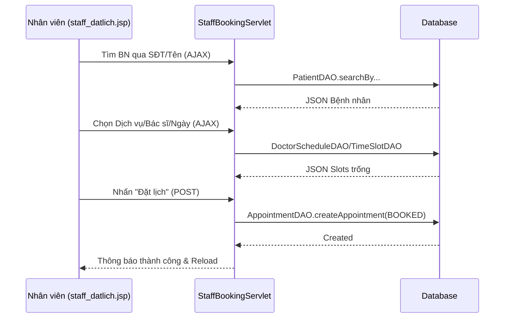

#### B. Đổi lịch hẹn cho bệnh nhân (Reschedule Appointment)
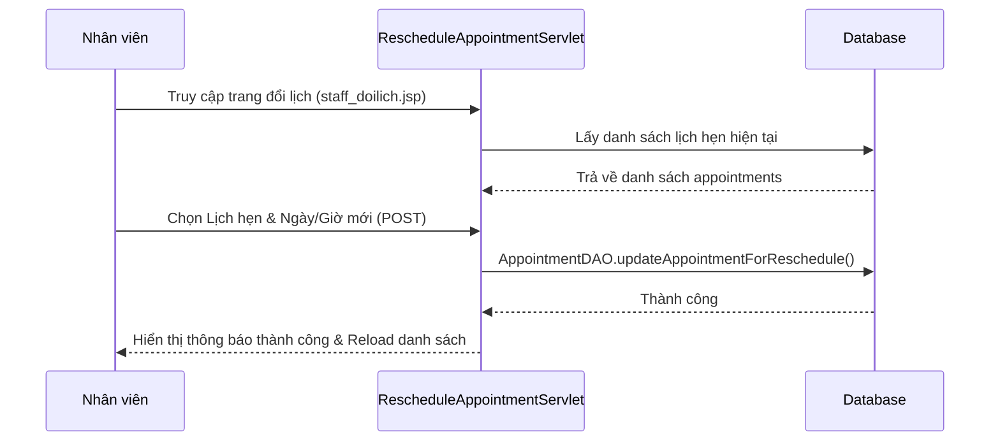

#### C. Tạo hóa đơn & Thu tiền (Create Invoice & Payment)
Mô tả chi tiết kỹ thuật:
- **Khởi tạo (staff_thanhtoan.jsp):** Hệ thống hiển thị danh sách "Cuộc hẹn chờ thanh toán" (những cuộc hẹn có trạng thái `COMPLETED` nhưng chưa có `BillId`).
- **Yêu cầu (AJAX POST):** Khi nhân viên nhấn "Tạo hóa đơn", một modal hiện ra để xác nhận dịch vụ và số tiền. Sau đó, JS gửi request đến `StaffPaymentServlet?action=createBill`.
- **Xử lý tại Servlet (`handleCreateBillFromModal`):**
    *   **Nhận diện:** Lấy thông tin Bệnh nhân, Bác sĩ, Dịch vụ và ID cuộc hẹn từ request.
    *   **Tạo mã:** Sinh mã hóa đơn (`BILL_XXXXXXXX`) và mã đơn hàng (`ORDER_XXXXXXXX`).
    *   **Logic Thanh toán:**
        *   **Tiền mặt/Thẻ:** Trạng thái đặt là `PAID` nếu trả đủ, `PENDING` nếu trả một phần.
        *   **Chuyển khoản:** Gọi `PayOSUtil.createPayOSPaymentRequestForStaff` để lấy QR VietQR động. Nhân viên hiển thị QR cho BN quét.
        *   **Trả góp:** Chuyển trạng thái sang `INSTALLMENT` và gọi `PaymentInstallmentDAO.createInstallmentPlan` để chia nhỏ kỳ hạn (3-12 tháng).
- **Lưu trữ (DAO):** 
    *   `BillDAO.createBill(bill)`: Lưu thông tin hóa đơn vào bảng `Bills`.
    *   `AppointmentDAO` (nếu có): Cập nhật thông tin ID hóa đơn vào bản ghi cuộc hẹn để đồng bộ.
- **Kết quả:** Trả về JSON thành công, hiển thị thông báo và cập nhật danh sách hóa đơn trên giao diện.

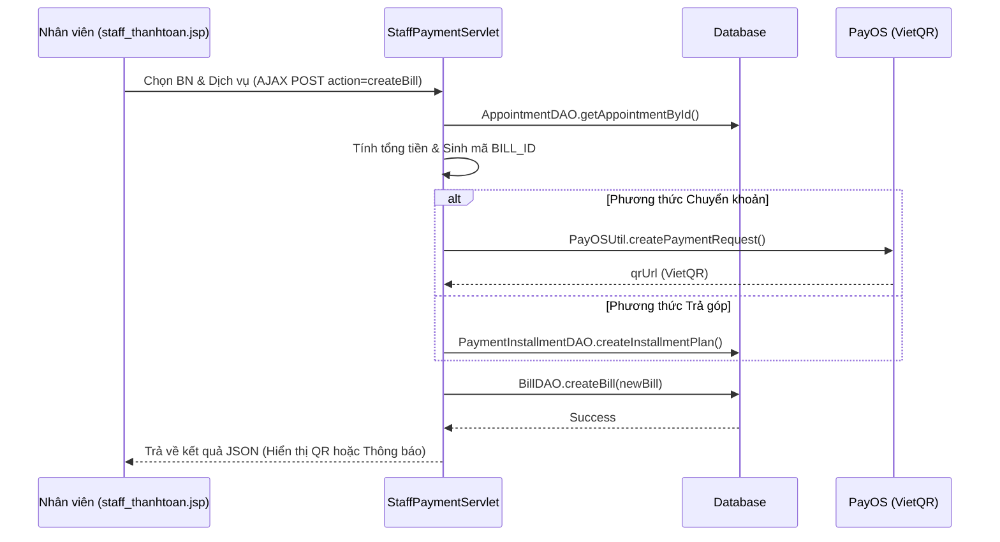

#### D. Thanh toán Trả góp (Installment)
```mermaid
sequenceDiagram
    ST as Nhân viên
    SV as StaffPaymentServlet
    DB as Database

    ST->>SV: Chọn HĐ & Chọn Trả góp (staff_thanhtoan.jsp)
    SV->>DB: createInstallmentPlan (PaymentInstallmentDAO)
    DB-->>SV: Tạo các kỳ hạn thanh toán
    SV->>DB: Lưu bill con đầu tiên (Down Payment)
    SV-->>ST: Hiển thị kế hoạch trả góp & QR thu tiền
```

#### E. Quản lý & Thu tiền trả góp (Installment Management)
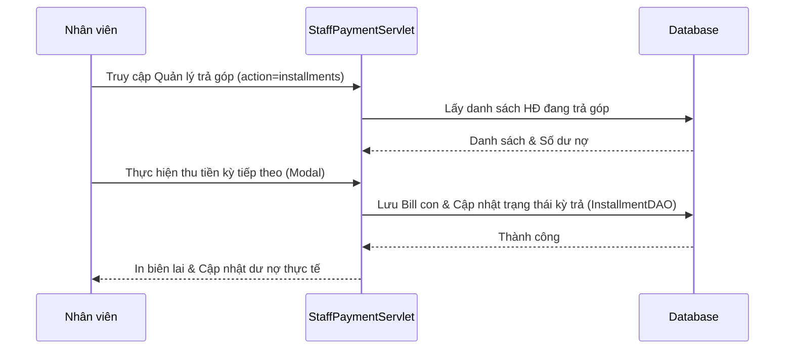

#### F. Đăng ký Nghỉ phép (Leave Request)
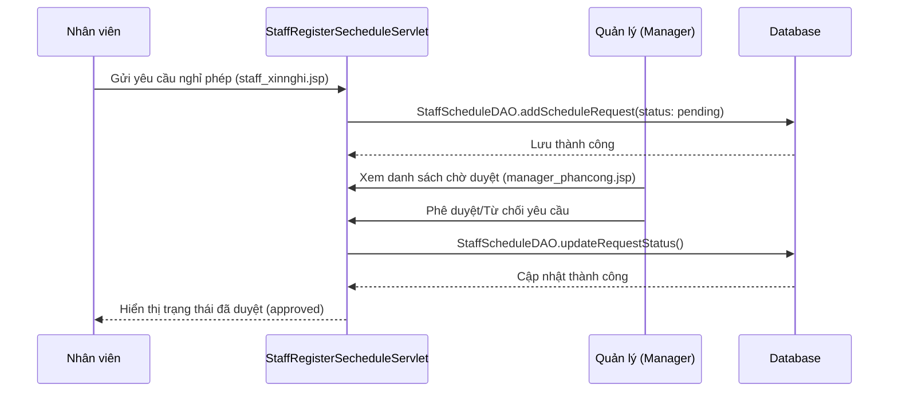

#### G. Tin tức Nha khoa (Dental News)
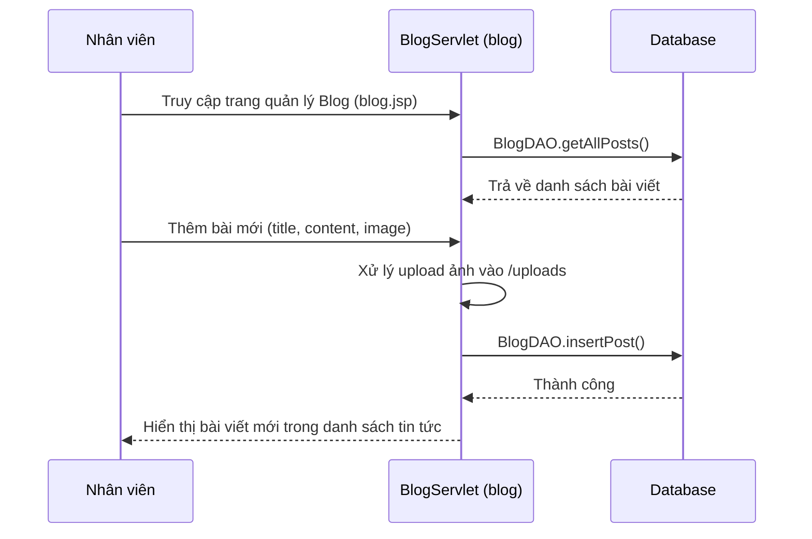


---

### 5. Luồng QUẢN LÝ (MANAGER)

#### A. Phê duyệt Lịch trực
```mermaid
sequenceDiagram
    M as Quản lý
    A as ManagerApprovalDoctorServlet
    DB as Database

    M->>A: Xem danh sách đăng ký lịch (manager_phancong.jsp)
    M->>A: Nhấn Duyệt/Từ chối
    A->>DB: Update Schedule Status (Approved/Rejected)
    DB-->>A: Thành công
    A-->>M: Cập nhật danh sách trang phân công
```

#### B. Quản lý Nhân sự (Thêm Bác sĩ/Nhân viên)
```mermaid
sequenceDiagram
    M as Quản lý
    S as AddStaffServlet
    DB as Database

    M->>S: Nhập thông tin nhân viên (manager_danhsach.jsp)
    S->>S: Kiểm tra quyền MANAGER
    S->>S: Validate Email/SĐT
    S->>DB: Insert vào bảng Users (Mật khẩu mặc định 12345)
    alt Role là DOCTOR
        S->>DB: Insert vào bảng Doctors
    else Role là STAFF
        S->>DB: Insert vào bảng Staffs
    end
    DB-->>S: Thành công
    S-->>M: Thông báo thành công & Reload danh sách
```

#### C. Quản lý Kho thuốc (Add Medicine)
```mermaid
sequenceDiagram
    M as Quản lý
    S as AddMedicineServlet
    DB as Database

    M->>S: Nhập tên thuốc, số lượng, đơn vị (manager_khothuoc.jsp)
    S->>DB: MedicineDAO.addMedicine()
    DB-->>S: Thành công
    S-->>M: Cập nhật kho thuốc & Thông báo thành công
```

#### D. Quản lý Khách hàng (View Customer List)
```mermaid
sequenceDiagram
    M as Quản lý
    S as ManagerCustomerListServlet
    DB as Database
    
    M->>S: Truy cập trang Khách hàng (manager_customers.jsp)
    S->>DB: Lấy danh sách bệnh nhân (Pagination)
    S->>DB: Thống kê khách hàng mới trong tháng
    DB-->>S: Trả về dữ liệu
    S-->>M: Hiển thị danh sách & Thống kê Dashboard
```


---

## 📂 Mapping Kỹ thuật (Servlet/JSP/DAO)

| Vai trò | Chức năng | JSP (Front-end) | Servlet (Back-end) | DAO |
| :--- | :--- | :--- | :--- | :--- |
| **Patient** | Google Login | `login.jsp` | `GoogleCallbackServlet` | `UserDAO` |
| **Patient** | Đăng ký | `register.jsp` | `SignUpServlet` | `UserDAO` |
| **Patient** | Hoàn tất thông tin | `information.jsp` | `RegisterInformation` | `UserDAO` |
| **Patient** | Book Appointment | `booking.jsp` | `BookingServlet` | `AppointmentDAO` |
| **Patient** | Online Payment | `payos.com` | `PayOSServlet` | `BillDAO` |
| **Patient** | Reset Password | `forgot-password.jsp` | `ResetPasswordServlet` | `UserDAO` |
| **Patient** | Chỉnh sửa profile | `user_taikhoan.jsp` | `UpdateUserServlet` | `PatientDAO/UserDAO` |
| **Patient** | Tư vấn/Chat | `patient_chat.jsp` | `ChatPageServlet` | `ChatMessages` (Table) |
| **Patient** | Chat với AI | `Sidebar/AI` | `ChatAiServlet` | `Gemini API` |
| **Doctor** | Thăm khám | `doctor_phieukham.jsp` | `SubmitMedicalReportServlet` | `MedicalReportDAO` |
| **Doctor** | Đăng ký lịch | `doctor_dangkilich.jsp`| `DoctorRegisterScheduleServlet`| `DoctorScheduleDAO` |
| **Doctor** | Đổi mật khẩu | `doctor_changepassword.jsp`| `DoctorChangePasswordServlet` | `UserDAO` |
| **Doctor** | Chỉnh sửa profile | `doctor_caidat.jsp` | `EditDoctorServlet` | `DoctorDAO` |
| **Doctor** | Tư vấn/Chat | `doctor_chat.jsp` | `ChatPageServlet` | `ChatMessages` (Table) |
| **Staff** | Đặt lịch hộ | `staff_datlich.jsp` | `StaffBookingServlet` | `AppointmentDAO` |
| **Staff** | Đổi lịch hẹn | `staff_doilich.jsp` | `RescheduleAppointmentServlet` | `AppointmentDAO` |
| **Staff** | Tạo hóa đơn | `staff_thanhtoan.jsp` | `StaffPaymentServlet` | `BillDAO` |
| **Staff** | Quản lý trả góp| `staff_thanhtoan.jsp` | `StaffPaymentServlet` | `PaymentInstallmentDAO` |
| **Staff** | Đăng ký nghỉ | `staff_xinnghi.jsp` | `StaffRegisterSecheduleServlet` | `StaffScheduleDAO` |
| **Staff** | Tin tức Nha khoa | `blog.jsp` | `BlogServlet` | `BlogDAO` |
| **Staff** | Thanh toán | `staff_thanhtoan.jsp` | `StaffPaymentServlet` | `BillDAO` |
| **Staff** | Check-in | `staff_dashboard.jsp` | `StaffHandleQueueServlet` | `AppointmentDAO` |
| **Manager** | Duyệt lịch | `manager_phancong.jsp` | `ManagerApprovalDoctorServlet` | `ScheduleDAO` |
| **Manager** | Thêm nhân sự | `manager_danhsach.jsp` | `AddStaffServlet` | `StaffDAO/DoctorDAO` |
| **Manager** | Quản lý kho thuốc| `manager_khothuoc.jsp`| `AddMedicineServlet` | `MedicineDAO` |
| **Manager** | Xem khách hàng | `manager_customers.jsp`| `ManagerCustomerListServlet` | `PatientDAO` |

---
*Tài liệu hướng dẫn hệ thống được cập nhật trực tiếp bởi Antigravity.*
