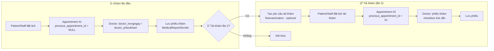
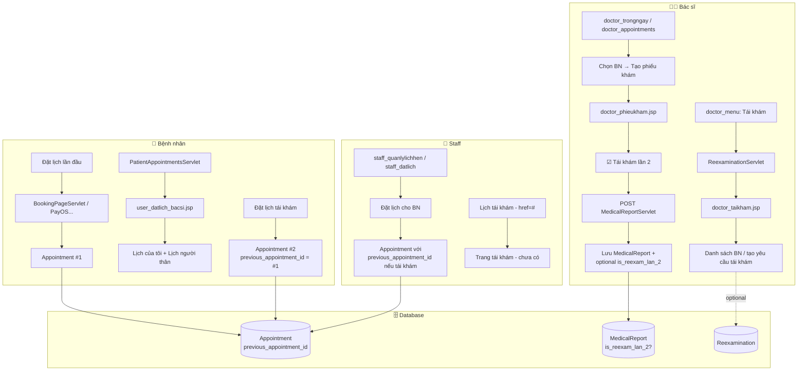
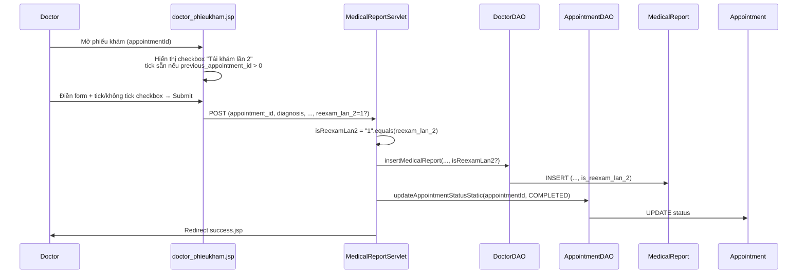
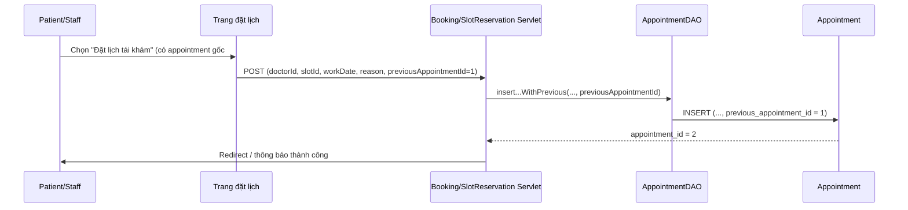
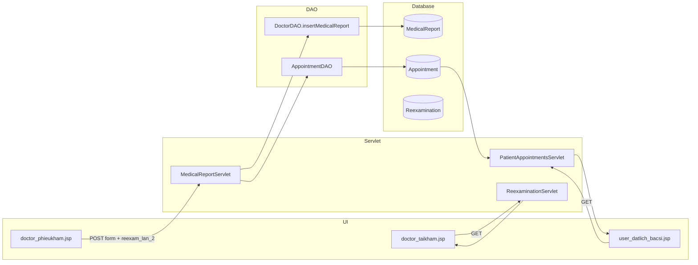
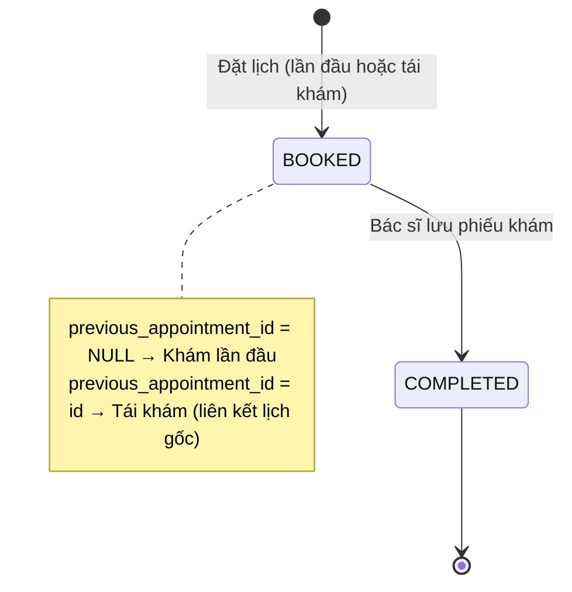

# Triển khai nghiệp vụ Tái khám – Step by step

Tài liệu hướng dẫn triển khai code cho luồng **tái khám lần 2** (bệnh nhân khám lần đầu → tái khám lần 2).

---

## Mermaid – Full luồng tái khám

### 1. Luồng tổng quan (end-to-end)



### 2. Luồng theo vai (Bác sĩ / Bệnh nhân / Staff)



### 3. Sequence – Phiếu khám (có checkbox Tái khám lần 2)



### 4. Sequence – Đặt lịch tái khám (set previous_appointment_id)



### 5. Luồng dữ liệu JSP → Servlet → DAO → DB



### 6. Trạng thái Appointment (tái khám hay không)



---

## Code chảy qua mấy database / bảng?

**Cả hệ thống dùng 1 database** (Azure SQL / SQL Server). Luồng tái khám **chạm các bảng** sau:

### Luồng lưu phiếu khám (MedicalReportServlet)

| Bảng (table) | Thao tác | Chỗ gọi |
|--------------|----------|---------|
| **MedicalReport** | INSERT | `DoctorDAO.insertMedicalReport(...)` |
| **Appointment** | UPDATE status | `AppointmentDAO.updateAppointmentStatusStatic(appointmentId, "COMPLETED")` |
| **Prescription** | INSERT (từng dòng đơn thuốc) | `DoctorDAO.insertPrescription(reportId, medId, qty, usage)` |
| **Medicine** | UPDATE (trừ tồn kho) | `MedicineDAO.reduceMedicineStock(medId, qty)` |

**Đọc (khi mở phiếu khám):**

| Bảng | Thao tác | Chỗ gọi |
|------|----------|---------|
| **Appointment** | SELECT | `AppointmentDAO.getAppointmentWithPatientInfo(appointmentId)` |
| **Patients** | SELECT | `PatientDAO.getPatientById(patientId)` |
| **Doctors** | SELECT | Session / `DoctorDAO.getDoctorById` |

### Luồng đặt lịch (tái khám hoặc lần đầu)

| Bảng | Thao tác | Ghi chú |
|------|----------|--------|
| **Appointment** | INSERT | Có thể có cột `previous_appointment_id` khi đặt lịch tái khám |
| **TimeSlot** | SELECT | Lấy slot trống |
| **Patients**, **Doctors** | SELECT | Validate / hiển thị |

### Bảng có trong DB nhưng code chưa dùng (tái khám)

| Bảng | Ghi chú |
|------|--------|
| **Reexamination** | Đã tạo trong `dental_clinic.sql`, chưa có ReexaminationDAO / Servlet ghi |

### Tóm tắt số bảng luồng tái khám chạm

- **Ghi (write):** 4 bảng — `MedicalReport`, `Appointment`, `Prescription`, `Medicine`.
- **Đọc (read):** `Appointment`, `Patients`, `Doctors` (và có thể `TimeSlot` khi đặt lịch).
- **1 database**, nhiều bảng trong cùng DB đó.

---

## Tổng quan luồng

1. **Phiếu khám (doctor):** Bác sĩ tick checkbox "Tái khám lần 2" khi khám → lưu phiếu.
2. **Backend:** Nhận `reexam_lan_2`, (tùy chọn) lưu vào DB.
3. **Đặt lịch tái khám:** Khi tạo cuộc hẹn tái khám → set `Appointment.previous_appointment_id`.

---

## Bước 1: Servlet đọc checkbox (ĐÃ LÀM)

**Mục tiêu:** Backend nhận và xử lý tham số "Tái khám lần 2".

**File:** `src/java/controller/treatment/MedicalReportServlet.java`

- Trong `doPost()`:
  - Đọc `request.getParameter("reexam_lan_2")`.
  - `boolean isReexamLan2 = "1".equals(reexamLan2);`
  - Log ra console để kiểm tra (nghiệp vụ đã rõ).

**Trạng thái:** Đã thêm code. Khi submit phiếu khám có tick checkbox, log sẽ in `reexam_lan_2 (tái khám lần 2): true/false`.

---

## Bước 2 (Tùy chọn): Lưu “tái khám lần 2” vào bảng MedicalReport

**Mục tiêu:** Lưu lại thông tin “đây là lần tái khám thứ 2” vào DB để báo cáo/thống kê.

### 2.1. Cập nhật database

Chạy script SQL (Azure SQL / SQL Server):

```sql
ALTER TABLE MedicalReport
ADD is_reexam_lan_2 BIT NULL DEFAULT 0;
```

### 2.2. Cập nhật model

**File:** `src/java/model/entity/MedicalReport.java`

- Thêm field:
  - `private Boolean reexamLan2;` (hoặc `private boolean reexamLan2;`)
- Thêm getter/setter tương ứng.

### 2.3. Cập nhật DAO

**File:** `src/java/dao/DoctorDAO.java`

- Method `insertMedicalReport(...)`:
  - Thêm tham số `boolean isReexamLan2`.
  - Câu SQL INSERT thêm cột `is_reexam_lan_2`, thêm `?` và `ps.setBoolean(...)`.

### 2.4. Cập nhật Servlet

**File:** `src/java/controller/treatment/MedicalReportServlet.java`

- Khi gọi `DoctorDAO.insertMedicalReport(...)` truyền thêm `isReexamLan2`.

Sau bước 2, mỗi phiếu khám sẽ lưu được có phải “tái khám lần 2” hay không.

---

## Bước 3: Khi đặt lịch tái khám – set previous_appointment_id

**Mục tiêu:** Cuộc hẹn tái khám phải gắn với cuộc hẹn gốc.

**Cách làm:**

- Khi **tạo Appointment mới** cho “tái khám” (từ trang bác sĩ / staff / bệnh nhân):
  - Nếu có **appointment gốc** (lần khám trước), set `previous_appointment_id = appointment_id` của lần đó.
- Trong **AppointmentDAO** (hoặc chỗ insert appointment):
  - Dùng câu INSERT có cột `previous_appointment_id`.
  - Ví dụ: `INSERT INTO Appointment (..., previous_appointment_id) VALUES (..., ?)`.

**Ví dụ chỗ cần sửa:**

- `AppointmentDAO.insertAppointmentBySlotId(...)` hoặc method tạo appointment cho “đặt lịch tái khám”:
  - Thêm tham số `Integer previousAppointmentId`.
  - Nếu `previousAppointmentId != null && previousAppointmentId > 0` thì set vào câu INSERT.

Sau bước 3, phiếu khám mở cho cuộc hẹn tái khám sẽ có `appointment.getPreviousAppointmentId() > 0` → checkbox “Tái khám lần 2” trên JSP có thể tick sẵn (đã làm ở phiếu khám).

---

## Bước 4 (Tùy chọn): Trang danh sách tái khám + bảng Reexamination

**Mục tiêu:** Dùng bảng `Reexamination` để quản lý yêu cầu tái khám và lịch đã đặt.

- Tạo **ReexaminationDAO** (insert, get by appointment, get list theo bác sĩ/patient, update status).
- Servlet **tạo yêu cầu tái khám** (bác sĩ chọn appointment + ngày gợi ý + ghi chú → insert Reexamination).
- Trang **doctor_taikham.jsp** load dữ liệu thật (danh sách bệnh nhân / reexamination requests) thay cho data giả.
- Khi **đặt lịch tái khám** (staff/patient): tạo Appointment với `previous_appointment_id` và (nếu dùng) cập nhật Reexamination (status, scheduled_appointment_id).

---

## Thứ tự làm gợi ý

| Bước | Nội dung                         | Ưu tiên |
|------|----------------------------------|--------|
| 1    | Servlet đọc `reexam_lan_2`       | ✅ Đã xong |
| 2    | Lưu is_reexam_lan_2 vào MedicalReport | ✅ Đã triển khai |
| 3    | Set previous_appointment_id khi tạo appointment tái khám | ✅ Đã triển khai |
| 4    | ReexaminationDAO + trang tái khám | Sau khi 3 ổn |

### ⚠️ Trước khi chạy app (sau khi pull code mới)

Chạy script SQL thêm cột tái khám cho phiếu khám:

```bash
# Trong Azure Data Studio / SSMS: mở và chạy file
doc/sql/alter_medical_report_reexam_lan2.sql
```

---

## Kiểm tra nhanh

1. **Bước 1:** Vào phiếu khám → tick "Tái khám lần 2" → Lưu phiếu khám → xem log server: có dòng `reexam_lan_2 (tái khám lần 2): true`.
2. **Bước 2:** Sau khi thêm cột và code → kiểm tra bảng `MedicalReport`: cột `is_reexam_lan_2` = 1 khi đã tick.
3. **Bước 3:** Tạo cuộc hẹn tái khám (từ luồng đặt lịch) → kiểm tra bảng `Appointment`: `previous_appointment_id` trỏ đúng cuộc hẹn gốc.
